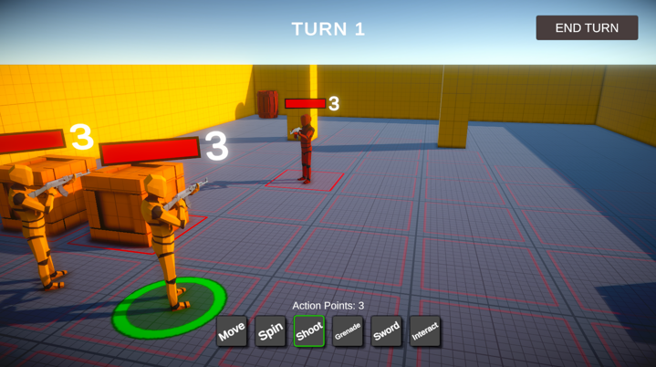
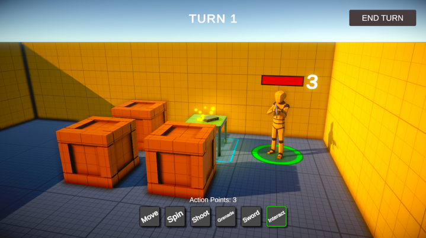
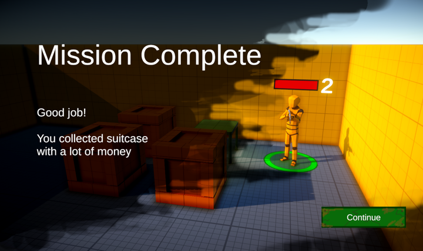

# CodeMonkeyTurner

**Play the game on --> [itch.io](https://ajver.itch.io/turner) <--**

Turn based game made with awesome CodeMonkey's course: https://www.gamedev.tv/p/unity-turn-based-strategy

The game is finally in version 1.0!

In this game player must complete given missions (i.e. Find and collect a specific item, capture an enemy without killing him, etc.). The game is turn-based, you can choose from several actions, but you have limited action points. Then it's time for the Enemy's turn.

I still improve the game, after I finished the course. I keep adding new features and assets. The course included only basic game mechanics. 

Most of the assets (graphics, models, audio) are from public domain, some made by myself.

## Screen shots

